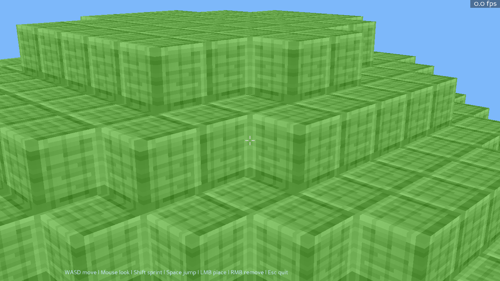
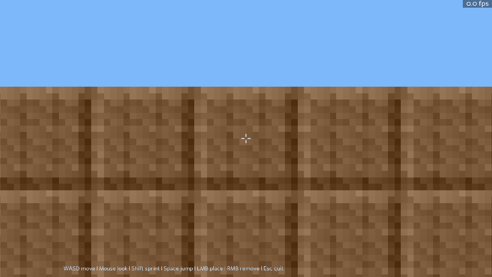
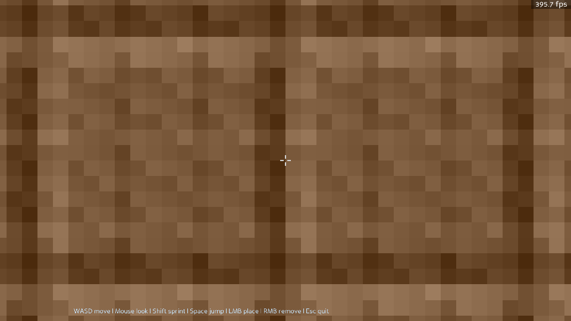
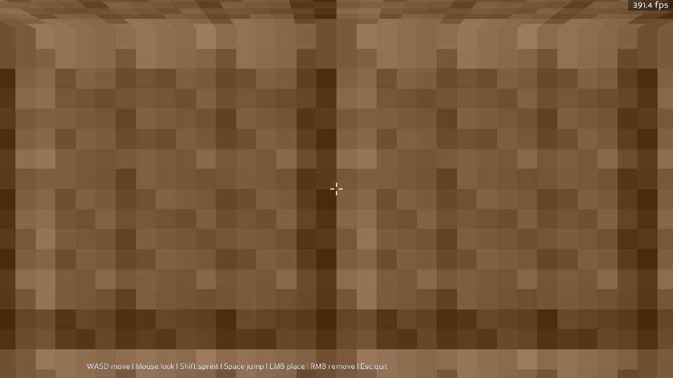

# Python Minecraft-Style Starter

A small Minecraft-style prototype built with **Python + Panda3D**.

## Features
- First-person playable character
- Mouse-look with pointer lock behavior
- Seed-based randomized terrain platform
- One generated tree (log + leaves) at a seed-based location on the platform
- Spawn point randomized each run (not tied to seed)
- Basic gravity and jumping
- Place/remove blocks with mouse
- Light-gray plus crosshair with empty center

## Setup

```bash
python3 -m venv .venv
source .venv/bin/activate
pip install -r requirements.txt
python main.py
python main.py --seed 12345
```

If `--seed` is omitted, a random seed is chosen automatically.

## Controls
- `WASD`: move
- `Mouse`: look around
- `Shift`: sprint
- `Space`: jump
- `Left click`: place block
- `Right click`: remove block
- `Esc`: quit

The active seed is shown on screen every run.

## Screenshots

### Main stage



### Test environments

Camera wall setup:



Reverse-L overhang setup:



Low-overhang jump setup:



## Headless E2E test

Run the offscreen end-to-end render tests (include screenshot capture):

```bash
.venv/bin/python -m unittest tests/test_headless_e2e.py
```

The suite includes:
- A render smoke test with screenshot output.
- A dedicated camera-wall environment: a small platform with a 2-block-high wall on one side, scripted movement into the wall, and assertions to detect camera wall clipping / seeing through walls.
- A reverse-L overhang environment: a platform with a 3-block-high wall plus overhang extension, scripted movement under the extension, and assertions that fail if player vertical position increases unexpectedly.
- A low-overhang jump environment: similar reverse-L setup with a lowered overhead ceiling, scripted jump while under the ceiling, and assertions that fail if the player phases upward through the block above.
- Screenshot artifacts are written to `test_artifacts/`.
