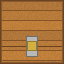
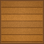
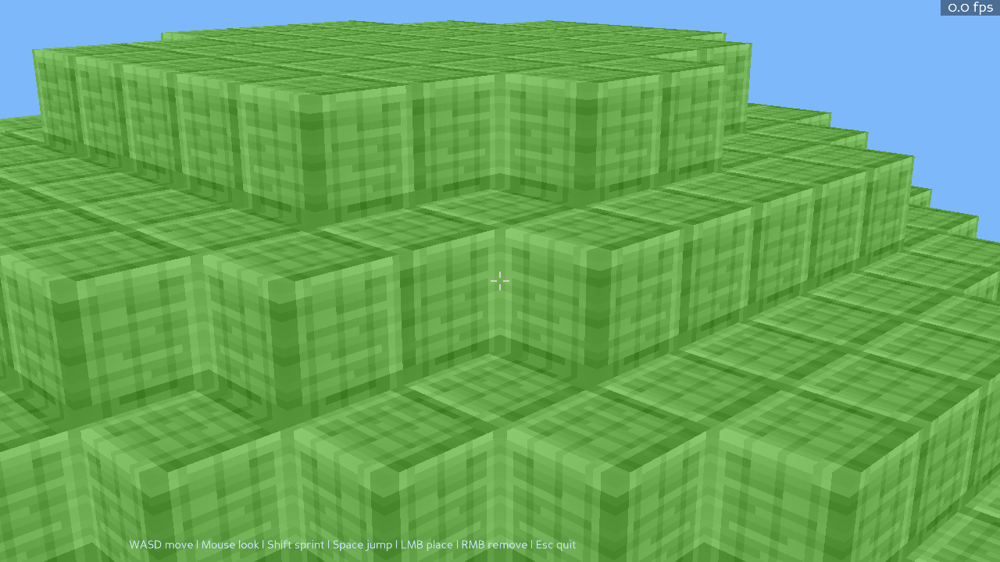
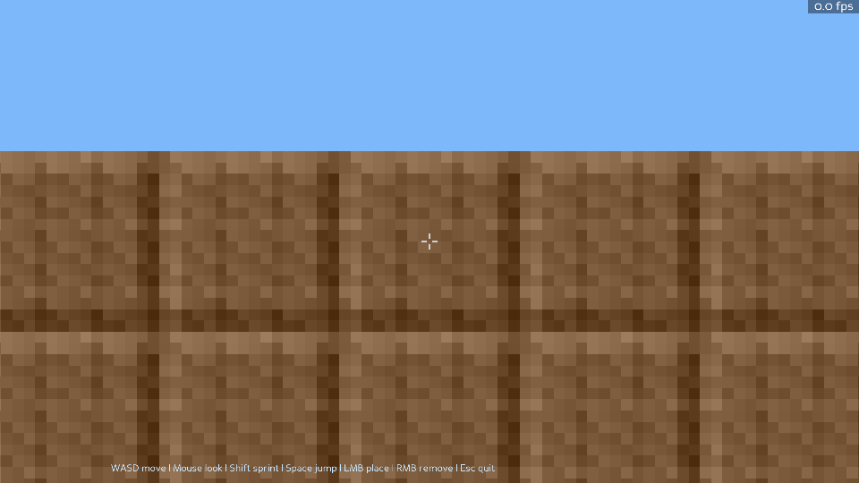
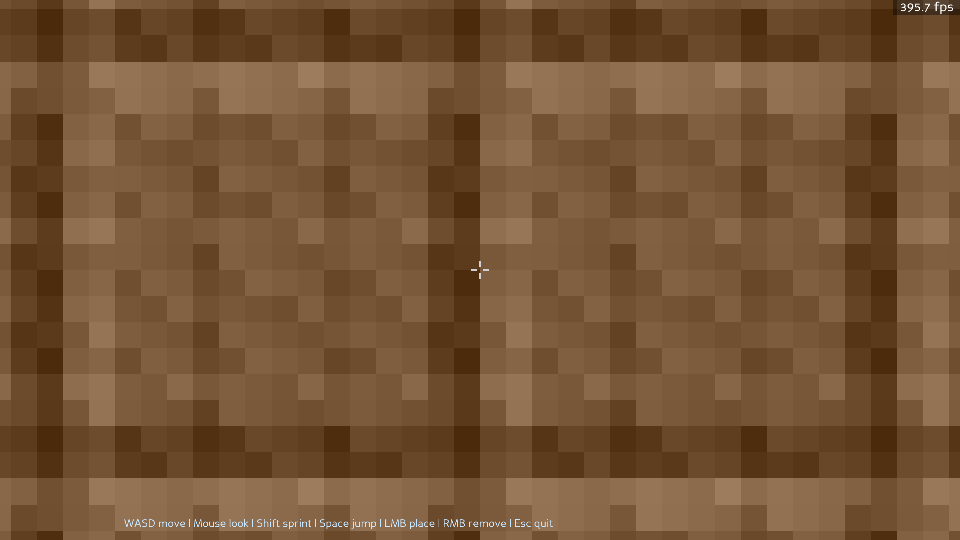
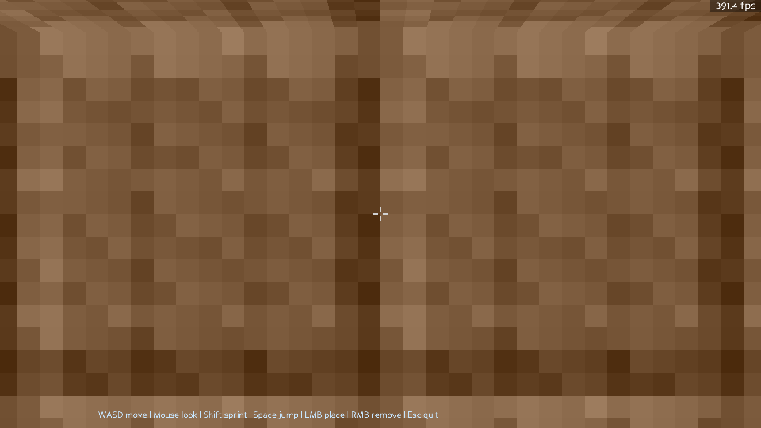

# Python Minecraft-Style Starter

A small Minecraft-style prototype built with **Python + Panda3D**.

## Features
- First-person playable character
- Mouse-look with pointer lock behavior
- Seed-based randomized terrain platform
- Seed-determined tree generation (count is 0..15 and locations vary by seed)
- Seed-determined chest placement (location varies by seed, always placed above terrain)
- Spawn point determined by seed (same seed => same spawn)
- Basic gravity and jumping
- Place/remove blocks with mouse
- Light-gray plus crosshair with empty center

## Setup

```bash
python3 -m venv .venv
source .venv/bin/activate
python -m pip install -r requirements.txt
python main.py
python main.py --seed 12345
```

If `--seed` is omitted, a random seed is chosen automatically.

If `python` is not available on your machine, use `.venv/bin/python` (after creating the venv) or run via `python3`.

## Project layout
- `main.py`: Panda3D app, terrain generation, block placement, log model template.
- `assets/textures/`: 16x16 block textures (nearest-neighbor sampling), including `log_side.png` and `log_top_bottom.png`.
- `docs/screenshots/`: curated screenshots for the README.
- `tests/test_headless_e2e.py`: offscreen render/movement tests (writes images to `test_artifacts/`).

## Textures

Log side:


Log top/bottom:


Chest (front/side/top):





## Controls
- `WASD`: move
- `Mouse`: look around
- `Shift`: sprint
- `Space`: jump
- `Left click`: place block
- `Right click`: remove block
- `Esc`: quit

The active seed is shown on screen every run.

## Screenshots

### Main stage



### Test environments

Camera wall setup:



Reverse-L overhang setup:



Low-overhang jump setup:



## Headless E2E tests

This repo includes a small set of offscreen (headless) render + movement tests in `tests/test_headless_e2e.py`.

They exist to catch regressions that are easy to miss by eye:
- Rendering smoke test (does the game draw a frame offscreen?)
- Log mesh/UV alignment (logs are a custom model, not the same as `models/box`)
- Collision/camera scenarios (wall contact, overhangs, low ceilings)

Run the full suite (writes screenshots to `test_artifacts/`):

```bash
.venv/bin/python -m unittest -v tests/test_headless_e2e.py
```

Run a single test (example):

```bash
.venv/bin/python -m unittest -v tests.test_headless_e2e.HeadlessE2ETest.test_log_on_block_on_platform_screenshot
```

Common artifacts:
- `test_artifacts/headless_e2e_frame.png`: render smoke test output.
- `test_artifacts/log_top_alignment.png`: top-down ortho render used by the log centering assertions.
- `test_artifacts/log_side_alignment.png`: side ortho render used by the log centering assertions.
- `test_artifacts/log_on_block_on_platform.png`: platform + stone + log stack, used for visual debugging.
- `test_artifacts/camera_wall_start.png`, `test_artifacts/camera_wall_at_wall.png`: camera-wall scenario screenshots.
- `test_artifacts/reverse_l_overhang_start.png`, `test_artifacts/reverse_l_overhang_under.png`: overhang scenario screenshots.
- `test_artifacts/low_overhang_jump_start.png`, `test_artifacts/low_overhang_jump_after.png`: low-ceiling jump scenario screenshots.

### Log 0.5-block offset regression note

If logs ever look shifted by roughly half a block (down/left/forward) compared to normal blocks, the most likely cause is a
coordinate-space mismatch between the built-in cube model and the custom log model.

Symptom (typical): a log at block key `(x, y, z)` appears like it was rendered at about `(x-0.5, y-0.5, z-0.5)` relative to other blocks.

Cause: Panda3D's built-in `models/box` spans local coordinates `(0..1)` (origin at the min corner), but the custom log template
was previously built as a centered cube `(-0.5..0.5)`. If you position both using the same block placement mapping, the log ends up
offset by `(-0.5, -0.5, -0.5)` in local block space.

Fix: ensure `MinecraftClone.create_log_model_template` produces geometry whose tight bounds match `models/box` (approximately `(0..1)`).
The current approach is to offset the log geometry by `(0.5, 0.5, 0.5)` inside the template.

Quick sanity check snippet (run in a venv):

```bash
.venv/bin/python - <<'PY'
from panda3d.core import loadPrcFileData
loadPrcFileData('', 'window-type offscreen')
loadPrcFileData('', 'audio-library-name null')
from main import MinecraftClone
g = MinecraftClone(capture_mouse=False, seed=1)
try:
    print('cube:', g.cube_model.getTightBounds())
    print('log :', g.log_model_template.getTightBounds())
finally:
    g.destroy()
PY
```

Note on coordinates: block keys are stored as `(x, y, z)` where `y` is the vertical layer. Panda3D uses `z` as up, and this repo maps
block keys to world positions as `(x, z, y)` (see `MinecraftClone.block_key_to_world_center`).
